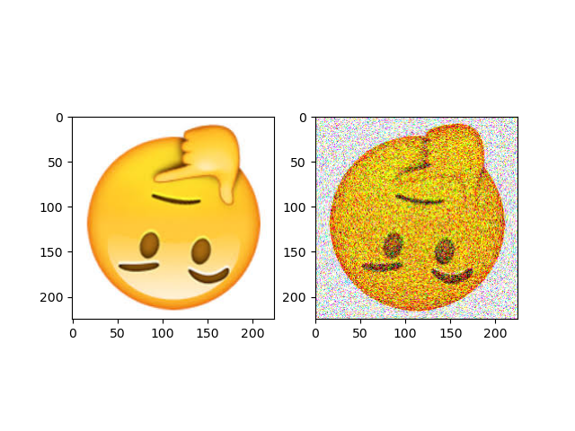

# Deep fried meme

A Python script to make deep fried memes.

## What are deep fried memes?

Deep fried memes are memes that have had their visual properties exaggerated and blown out for artistic effect. Some properties commonly adjusted are saturation, brightness, contrast, color balance, vibrancy, sharpness, and noise. [Ref](https://www.vice.com/en_us/article/zmm885/how-to-deep-fry-a-meme)

## Installation

Python 3

Modules:
  - opencv
  - numpy
  - matplotlib

```
pip install -r req.txt
```

## Usage

Function `RGB_deep_fry()` from `deep_fried_meme.py`

```Python
def RGB_deep_fry(img_obj, bright_coeff = (1, 0), gaussian_blur = (7, 7), satuartion_mod = 1, noise_type = 'gauss'):
    # img_obj : opencv format for image
    # brightness coeff : a = bright_coeff[0]; b = bright_coeff[1]; read RGB_mod_bright()
    # gaussian_blur : kernel size
    # satuartion_mod : satuartion multiply
    # noise_type : gauss, poisson, s&p, speckle
```

## Example

You can run `try_deep_fried_meme.py` as an example.


